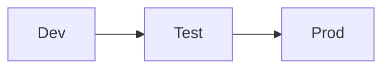
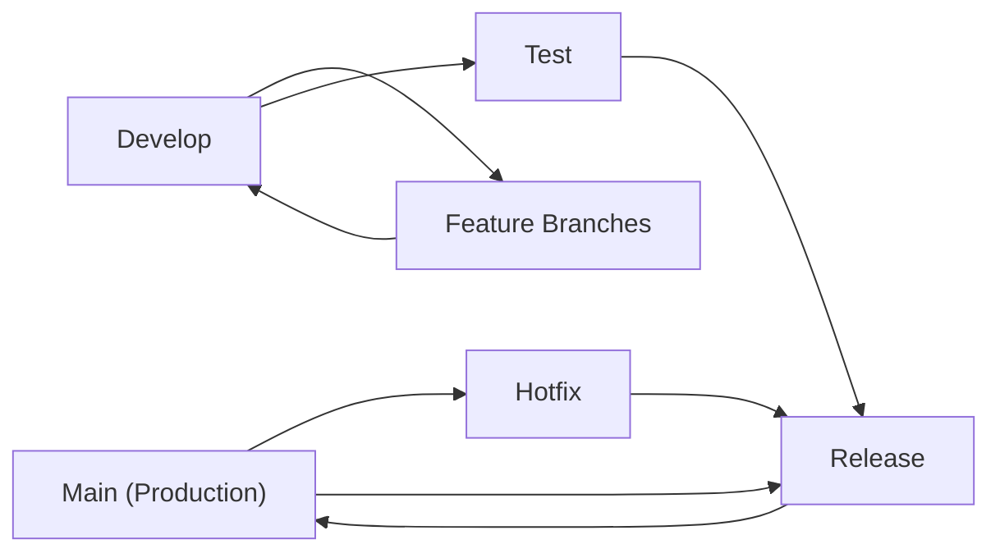

Today, let's dive into **Git Flow strategies for Machine Learning (ML) projects**.  
Choosing the right branching model is essential for keeping your codebase organized, scalable, and efficient—especially as your project grows.

---

## Why Git Flow for ML?

ML projects often involve experimentation, collaboration, and rapid iteration. A clear Git workflow helps you:

- Track experiments and features
- Collaborate without conflicts
- Safely deploy models to production

---

## Solo Workflow

If you're working **solo**, keep it simple:

- **Dev**: Where you experiment and develop new features.
- **Test**: For validating models and code before production.
- **Prod**: Stable, production-ready code and models.

---

## Team Workflow

For teams, a more structured approach is recommended:

- **Main**: Stable, production-ready branch.
- **Develop**: Active development happens here.
- **Test**: Staging area for validation and QA.
- **Feature Branches**: For new features, experiments, or model improvements.
- **Hotfix**: Emergency fixes for production issues.
- **Release**: Pre-production stabilization and final testing.

---

## Example Branch Naming

- `feature/model-tuning`
- `hotfix/data-leak-fix`
- `release/v1.2.0`

---

## Tips

- Use **pull requests** for code reviews and discussions.
- Tag releases for reproducibility.
- Document experiments and results in each branch.

---

💬 **What Git Flow do you use for your ML projects?**  
Share your thoughts through my Linkedin post   and let's discuss best practices!
<iframe src="https://www.linkedin.com/embed/feed/update/urn:li:share:7301970692961439745?collapsed=1" height="649" width="504" frameborder="0" allowfullscreen="" title="Embedded post"></iframe>