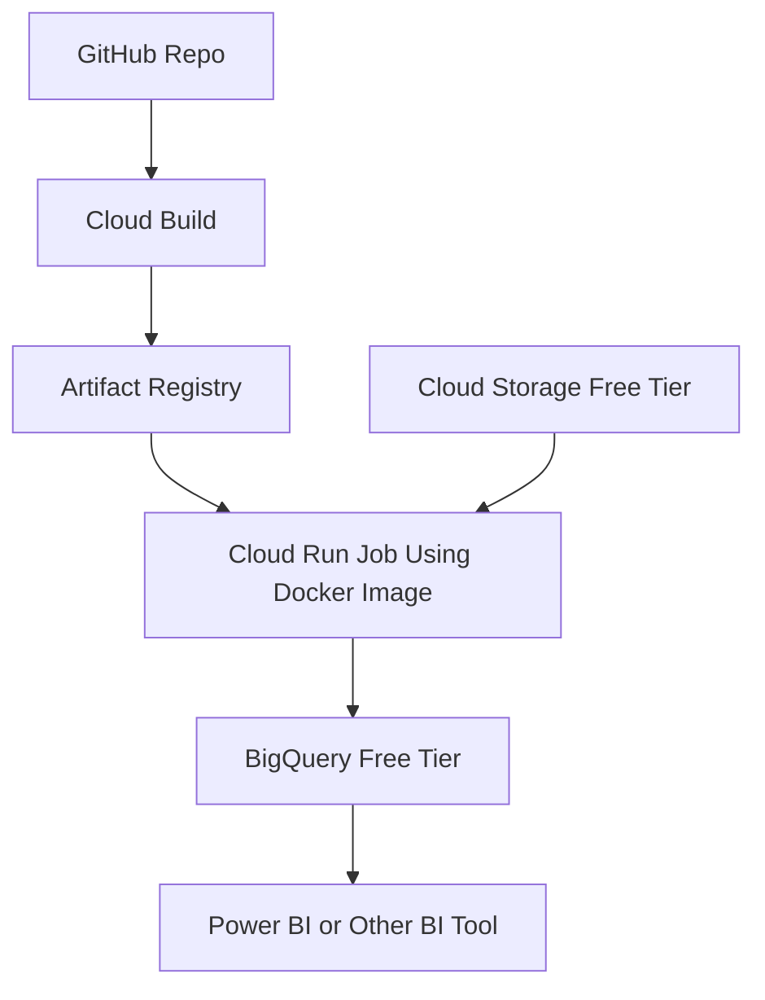

Today, let's dive into **Google Cloud Free Tiers** and how you can leverage them for your projects.  

Google Cloud offers a variety of free tier options that can help you get started without incurring costs.

That being said, if you want to use Google Cloud Free Tiers, you will need to put your Credit Card in the billing account, and you may incur charges if you exceed the free tier limits.)

I will try to explain how can I use them for my projects.

---

## Google Cloud Free Tiers Overview
Google Cloud provides several free tier options, including:
- **Always Free**: Limited usage of certain services that are free forever.(e.g., Compute Engine, Cloud Storage)
- **Free Trial**: A $300 credit for new users to explore and use any Google Cloud services for 90 days.
- **Free Tier for Specific Services**: Some services offer free usage limits, such as Google Cloud Functions, BigQuery, and more.
- **Promotional Offers**: Occasionally, Google Cloud provides promotional offers for specific services or events.

### Cost Breakdown
- **Cloud Storage**: 5GB/month (Always Free) → $0
- **BigQuery**: 1TB queries/month (Free Tier) → $0
- **Cloud Run Jobs**: 180K vCPU-seconds/month → $0
- **Total Monthly Cost**: **$0** 💰

---

### Project Architecture Overview
Here is a high-level architecture of the data pipeline I built using Google Cloud Free Tiers:

From a GitHub repo, Cloud Build builds a Docker image and pushes it to Artifact Registry; a Cloud Run Job runs the container, reads data from Cloud Storage, and writes results to BigQuery—kept within free-tier limits.

Files in the repo:
- `cloudbuild.yaml` — builds the Docker image and pushes it to Artifact Registry on GitHub commits.
- `Dockerfile` — lightweight Python image for Cloud Run Jobs.
- `main.py` — minimal entrypoint; reads env vars (e.g., PROJECT_ID, DATASET, TABLE, DATE) and writes to BigQuery.
- `script/run_all.sh` — orchestrator; auto-computes yesterday’s DATE if not provided and triggers the job.
- `requirements.txt` — Python dependencies (e.g., `google-cloud-bigquery`, `pandas`).

You can find the complete code and setup instructions in my project page [here](https://aurelpow.github.io/portofolio-website/projects/nba-ml-pipeline/). 
You have a link to the GitHub repo and a detailed README.

--- 
### Cost guardrails (how I stay in free tiers)

- **Cloud Run Jobs**: small memory/short runs fit within the monthly free CPU+RAM allotment.
- **BigQuery**: keep total query processing < 1 TB/month and storage < 10 GB; use partitioned tables and SELECT specific columns.
- **Cloud Build**: typical rebuilds stay under 2,500 build-min/month.
- **Cloud Scheduler**: 1 daily trigger = 1 job (well within 3 free jobs/month).
- **Artifact Registry**: Keep artifacts tiny; Artifact Registry has a small free storage allowance.

--- 
### Set Alerts and Monitoring
- Set up **budget alerts** in Google Cloud Billing to notify you if you approach your free tier limits.
- Use **Cloud Monitoring** to track resource usage and set up alerts for unusual activity.

⚠️ You may be charged of few cents if you exceed the free tier limits, but you can always monitor your billing account to ensure you stay within budget.

---

## Conclusion

Google Cloud Free Tiers provide a great way to experiment and build projects without incurring costs. 
By carefully selecting services and optimizing usage, you can create powerful data pipelines and applications.
Feel free to reach out if you have any questions or need help getting started!

Happy coding! 🚀