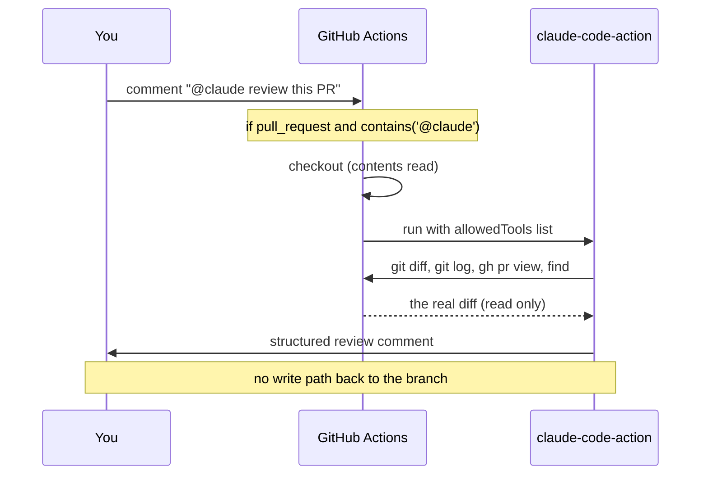

> **Level:** Intermediate | **Stack:** GitHub Actions, `anthropics/claude-code-action@v1`

> **TL;DR:** A small workflow turns Claude into an on-demand PR reviewer. It reads your real diff, follows your instructions, and can't push commits. On a real PR it caught a security bug: hardcoded `admin`/`admin` pgAdmin credentials I would have shipped.

---

## The 4m 30s that saved me an incident

I opened a pull request on my streaming pipeline and left one comment in the thread.

> **@claude** review this PR for bugs, security issues, and code quality. Don't run Unit Tests.

Then I went to make coffee. Four and a half minutes later a full review was waiting for me. It had a task checklist, a list of findings ranked by severity, and near the top a red flag on a hardcoded database password I had never noticed.

<figure>

<figcaption>The whole interface is one comment in the PR thread. Claude replies with a checklist of what it inspected.</figcaption>
</figure>

That is the entire interface. You write one comment, and Claude answers. This post covers how it works, why it is safe, and what it actually found.

---

## The problem with reviewing your own code

Reviewing your own PR is like proofreading your own writing. Your eyes read what you meant to type, not what is on the page. A teammate catches those things, but a teammate is not always free the moment you want to merge. And anyone skimming a 600 line diff at 6pm will miss the same boring bugs you did.

I did not want an AI that writes my code. I wanted a first reviewer wired into Git that does three things:

- reads the real diff, not a summary of it,
- follows my instructions, including "don't run the tests",
- never pushes commits to my branch.

That last point matters most to me. A reviewer that can quietly rewrite the code it is reviewing is not a reviewer.

---

## The code under review: a real streaming pipeline

The PR was on StreamFlix, a streaming analytics pipeline. Data flows from Kafka into Spark Structured Streaming, through a Delta medallion setup (Bronze, Silver, Gold), and out to Postgres for serving.

The diff was large. It touched:

- the Gold SQL schema (`sql/*.sql`),
- two Spark jobs (`gold_streaming.py`, `gold_aggregation.py`),
- reliability fixes in Bronze, Silver, and a Kafka reader,
- `docker-compose` and `Makefile` changes.

This is exactly the kind of change where a real bug hides in the one layer you were not paying attention to.

---

## How it works: a read-only reviewer

The whole thing is one GitHub Actions workflow. It rests on two ideas. It only runs when you mention it, and it gets the smallest set of permissions that still lets it review.

```yaml
name: Claude PR Review

on:
  issue_comment:
    types: [created]

jobs:
  review:
    # Run ONLY when a PR comment mentions @claude
    if: >
      github.event.issue.pull_request &&
      contains(github.event.comment.body, '@claude')
    runs-on: ubuntu-latest

    # Least privilege: it can READ code and WRITE comments, never commit
    permissions:
      contents: read
      pull-requests: write
      issues: write

    steps:
      - uses: actions/checkout@v4
        with:
          fetch-depth: 0            # full history so git diff and git log work

      - uses: anthropics/claude-code-action@v1
        with:
          claude_code_oauth_token: ${{ secrets.CLAUDE_CODE_OAUTH_TOKEN }}
          # Allow ONLY read-only inspection commands
          claude_args: >
            --allowedTools "Bash(git diff:*),Bash(git log:*),Bash(gh pr view:*),Bash(find:*)"
```

Two lines do the important work.

```yaml
# contents: read means the token cannot create a commit
permissions: { contents: read, pull-requests: write, issues: write }

# and inside Bash, only read-only commands are allowed
claude_args: --allowedTools "Bash(git diff:*),Bash(git log:*),Bash(gh pr view:*),Bash(find:*)"
```

`contents: read` gives the job's token no write access to your code. There is no way for it to push to the branch. The `--allowedTools` list is a second layer. Even the shell is limited to commands that only look at things: `git diff`, `git log`, `gh pr view`, `find`. It can read. It cannot change anything.



---

## What it found

Claude worked through a checklist you can watch: gather context, review the Gold schema, review each Spark job, review the reliability fixes, review the infra, review the security changes. At the end it wrote, in italics, *"Skipped unit test execution per instructions."* It followed the one rule I gave it.

### 🔴 Security: pgAdmin ships with `admin`/`admin` and no environment gate

<figure>

<figcaption>The finding that justified the whole experiment.</figcaption>
</figure>

The new `pgadmin` service in `docker-compose.yml` shipped with `PGADMIN_DEFAULT_PASSWORD: admin`, `PGADMIN_CONFIG_MASTER_PASSWORD_REQUIRED: "False"`, and port `5050` open, with no `profiles:` gate.

What made this serious was the next step Claude took. It read the file's own header comment and the production docs (`docs/running-the-pipeline.md`), and showed that the documented production command (`docker compose --env-file .env.prod up -d`) would bring pgAdmin up on port 5050 with an `admin`/`admin` login and the master password check turned off. Unlike `spark-submit-gold-batch`, it was not behind a profile. The new `postgres` service also opened `5432` to `0.0.0.0` with no gate at all.

That is not matching on the word "password." That is reading how three files fit together to prove the exposure was actually reachable.

### 🟡 Scalability: `write_to_postgres()` pulls the full result to the driver

<figure>

<figcaption>Scalability plus three correctness items, each pointing at a file and line.</figcaption>
</figure>

`write_to_postgres()` ran `df.collect()` into driver memory, then did a single `psycopg2` insert. That is fine at the roughly 5,500 rows in this PR. But it loads every Gold table into the driver as Python tuples and turns a parallel write into a single one. Once `content_popularity` grows, that is an out of memory crash on the driver waiting to happen. The suggested fix was `df.write.jdbc(...)` into a staging table, or `foreachPartition` with one connection per partition.

### 🟡 Correctness: three quieter ones

- **A streaming change hidden in a "pure rename" commit.** A list comprehension that kept the `StreamingQuery` handles was rewritten as a loop that throws them away. It is harmless today, since `awaitAnyTermination()` does not need the handles. But nothing can inspect the state of each query anymore, and it slipped into a commit labeled as a rename. Worth confirming it was on purpose.
- **`except Exception: pass`** around the dead letter read. It swallows every error, so a brief S3 or network blip would quietly report `invalid_records=0` instead of failing.
- **A window with no `partitionBy`** for `popularity_rank`. It pushes the whole DataFrame through one partition. That is needed for a true global rank, but it will become a bottleneck, and it is worth a comment.

None of these would fail a test. All of them are the kind of thing a tired reviewer scrolls straight past.

---

## Why this is the useful shape of AI review

The value here is not writing code. It is review that has context and stays in its lane.

- It read the real diff and tied every finding to a file and line.
- It cross checked the docs and other files to prove a finding was reachable, not just possible.
- It followed my instructions and skipped the tests I told it to skip.
- It did all of this as an identity that can read and comment but never commit.

It is a fast first reviewer, not a replacement for a human one. I still read the diff. But now I read it after the boring 80 percent is already flagged, so I can spend my attention on the parts that need real judgment.

---

## Try it yourself

1. Install the Claude GitHub App on your repo.
2. Generate an OAuth token with `claude setup-token` and store it as the `CLAUDE_CODE_OAUTH_TOKEN` repository secret.
3. Drop the workflow above into `.github/workflows/claude-review.yml`.
4. Keep `permissions: contents: read`. That is the line that removes the write path.
5. Limit `--allowedTools` to read-only commands.
6. Open a PR and comment: **@claude review this PR.**

---

## Your turn

Would you let an AI post reviews on your PRs? As a first pass, or not at all? And what is the one thing you would want it to catch every single time? I would really like to know. The answer says a lot about where each of us draws the line on keeping a human in the loop.
